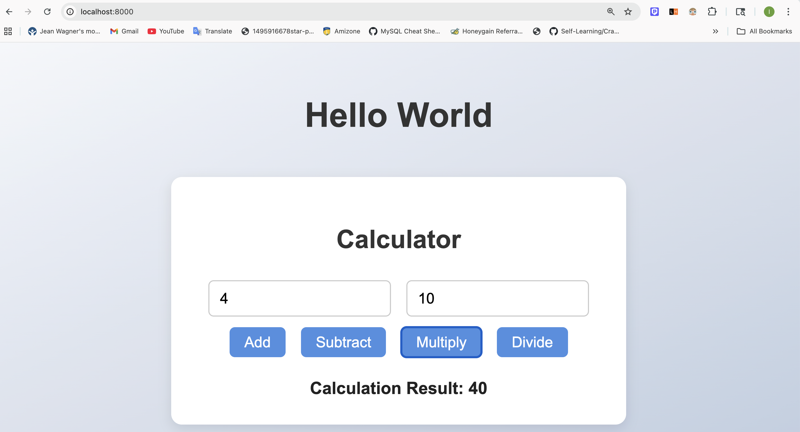
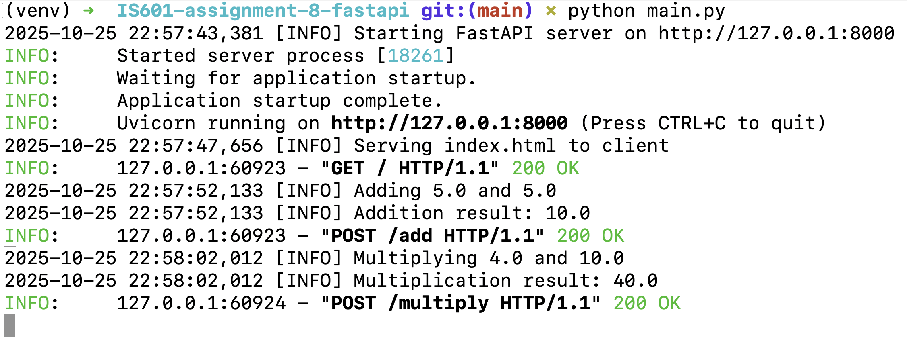
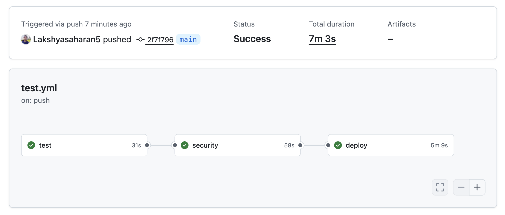

# IS601 Assignment-8 FastAPI

FastAPI based Maths Calculator

### DockerHub URL: <a href="https://hub.docker.com/r/lakshya1997/601_module8/tags">https://hub.docker.com/r/lakshya1997/601_module8/tags</a>

## Calculator Web Interface

## Logger Info

## Github Actions CI/CD

### All tests ran successfully including Unit tests, Integrations tests, E2E tests using Playwright.

